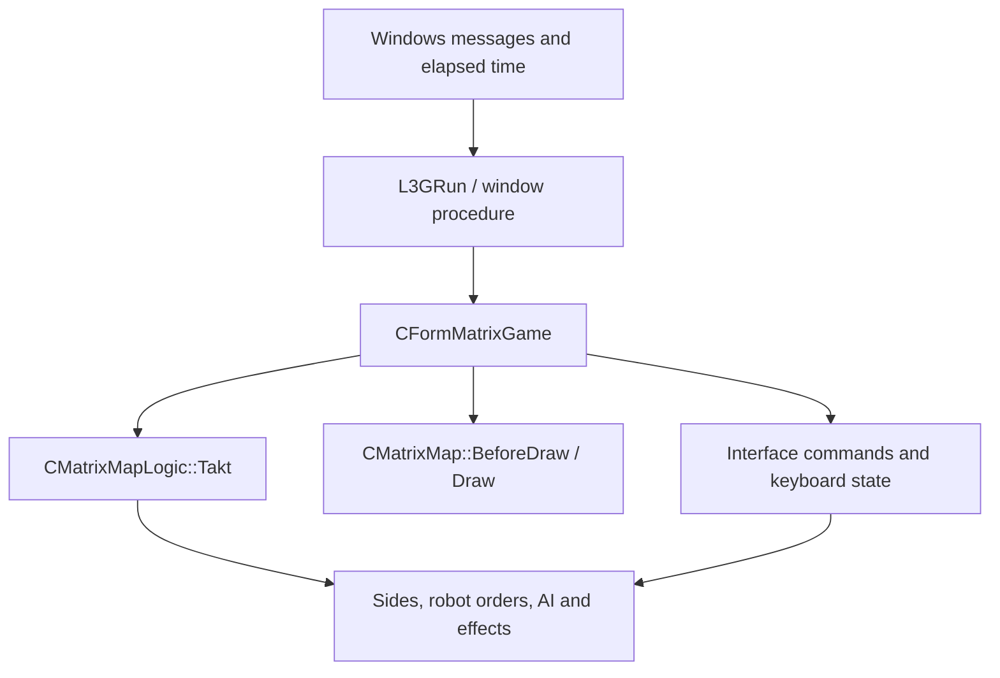

# Engine architecture

MatrixGame runs one battle through shared process state. This guide describes the source's ownership and call paths so changes can stay small and preserve existing gameplay. Use [Windows builds](BUILD_WINDOWS.md) for setup, [Data formats](DATA_FORMATS.md) for resource contracts, [Debugging](DEBUGGING.md) for failure investigation and [Testing](TESTING.md) for validation.

## Execution path

The standalone entry point is `WinMain` in [MatrixGame.cpp](../MatrixGame/src/MatrixGame.cpp). It calls `CGame::Init`, installs a `CFormMatrixGame`, runs `L3GRun`, and performs normal cleanup. A command-line map argument selects visibility calculation instead of the interactive loop.

`CGame::Init` seeds the shared random stream, resets base/graphics/game statics, creates the allocation-helper object referenced by `g_MatrixHeap`, opens `DATA/robots.pkg`, loads packed or text configuration, initializes the resource cache and DirectX device, applies settings, creates the map/interface objects, loads the selected map and builds the battle interface. Configuration must exist before readers such as `CMatrixConfig::ReadParams` and `SSpecialBot::LoadAIRobotType` run. GPU-dependent map preparation follows device creation.

The active loop is in [3g.cpp](../MatrixLib/3G/3g.cpp). It dispatches Windows messages, observes close/exit flags, skips updates while inactive or without a form, then advances reminders and the active form before drawing. Elapsed milliseconds are capped at 100 per iteration; the developer speed flag multiplies elapsed time before that cap. This is a variable-step loop rather than a fixed-step replay scheduler.

The diagram shows the main call direction. Simulation, interface and rendering still share map/configuration globals. [MatrixFormGame.cpp](../MatrixGame/src/MatrixFormGame.cpp) adapts Windows input to selection and orders, invokes map simulation and rendering, and forwards activation changes to keyboard state and device-resource handling. [MatrixLogic.cpp](../MatrixGame/src/MatrixLogic.cpp), [MatrixSide.cpp](../MatrixGame/src/MatrixSide.cpp) and [MatrixRobot.cpp](../MatrixGame/src/MatrixRobot.cpp) implement battle updates and order execution; [Logic](../MatrixGame/src/Logic) contains navigation/environment support.

Gameplay and interface code emit sound events through `CSound` in [MatrixSoundManager.cpp](../MatrixGame/src/MatrixSoundManager.cpp). The frontend reads the configuration's `Sounds` definitions and contains clip selection, positional attenuation, fading and layer/slot bookkeeping. Playback operations in this source path use `SMGDRangersInterface` callbacks for voice creation, play, destruction, volume and pan; calls without that interface return without playback. An emitted event is therefore not evidence that a sound was heard. A replacement backend must preserve event/resource names and ensure live voices remain owned and stoppable until destruction.

## Ownership and shared state

| State | Lifetime and responsibility | Main source |
| --- | --- | --- |
| `g_MatrixHeap` | Allocation-helper object created/deleted by initialization/teardown; allocations use the CRT heap, and this pointer owns no arena or allocation set | [CHeap.hpp](../MatrixLib/Base/CHeap.hpp), [MatrixGame.cpp](../MatrixGame/src/MatrixGame.cpp) |
| `g_MatrixData` | Owns the configuration tree; pointers/references obtained from it borrow that tree | [CBlockPar.hpp](../MatrixLib/Base/CBlockPar.hpp) |
| `g_Config` | Process-global settings; `Clear` frees the cursor table, while labels/descriptions are released directly by `CGame::Deinit` | [MatrixConfig.cpp](../MatrixGame/src/MatrixConfig.cpp), [MatrixGame.cpp](../MatrixGame/src/MatrixGame.cpp) |
| `g_MatrixMap` | Owns the battle's map state and entities; selection, order and UI references must follow entity lifetime | [MatrixMap.hpp](../MatrixGame/src/MatrixMap.hpp), [MatrixLogic.cpp](../MatrixGame/src/MatrixLogic.cpp) |
| `g_IFaceList`, popup menus and history | Created during game initialization and destroyed during game teardown; use map/configuration state while active | [Interface](../MatrixGame/src/Interface), [MatrixGame.cpp](../MatrixGame/src/MatrixGame.cpp) |
| `g_FormCur` | Borrows the active form; `FormChange` calls leave/enter but does not delete forms | [Form.cpp](../MatrixLib/3G/Form.cpp) |
| `g_Cache` | Owns cached resources; cache creation, content clearing and cache destruction are distinct operations | [Cache.cpp](../MatrixLib/3G/Cache.cpp) |
| `g_D3D`, `g_D3DD`, `g_Wnd` | EXE-created or host-provided graphics/window state; `L3GDeinit` currently performs window/gamma cleanup without releasing either DirectX interface | [3g.cpp](../MatrixLib/3G/3g.cpp) |
| `CFile` package collection | Owns open archives; individual package-backed files must close before package release | [CFile.cpp](../MatrixLib/Base/CFile.cpp) |
| `g_RangersInterface` | Borrowed host callback table; its owner is the host application | [MatrixGameDll.hpp](../MatrixGame/src/MatrixGameDll.hpp) |

`CHeap` contains static allocation operations. The heap arguments in `HNew`/`HAlloc`/`HFree`/`HDelete` do not select an allocator; storage comes from CRT `calloc`/`realloc`/`free`. Deleting `g_MatrixHeap` releases only that helper object. Debug allocation tracking is global and reported at base shutdown.

`HNew` obtains zeroed storage through `CHeap` and then invokes the constructor. Several legacy classes depend on that zeroing for members their constructors do not initialize, including a robot's base pointer. Replacing an engine allocation with ordinary `new`, `std::make_unique` or stack storage therefore requires an initialization audit. Use matching typed destruction (`HDelete`) for engine-allocated objects; `HFree` alone does not run a nontrivial destructor. New ownership wrappers can retain this allocator contract with a custom deleter.

Standard containers and strings need proper construction, movement and destruction. Preserve serialization separately from in-memory ownership: relocating a class containing a string or vector with `memcpy`/`realloc` is unsafe even if a serialized record is a byte layout. [CStorage.hpp](../MatrixLib/Base/CStorage.hpp) is an example of owned buffers and movable records with explicit schema-copy behavior.

## Teardown and failure boundaries

The normal standalone path calls `CGame::Deinit`, leaves and deletes the game form, clears cached resources, calls `L3GDeinit`/`CacheDeinit` and finally performs base shutdown. Within `Deinit`, AI definitions/cursor data are cleared, followed by render/hint/map/configuration-tree objects, interfaces/history/menu data, labels/descriptions, instance-drawing state, packages and the allocation-helper object. Inspect the actual order before moving any release: it is more specific than a simple reversal of startup.

`L3GDeinit` restores gamma, clears Debug helpers, resets device-capability data and destroys the owned window or restores the host window procedure. Its `g_D3DD->Release()` and `g_D3D->Release()` code is commented out, so it does not release the DirectX device/interface, including in the standalone EXE.

The standalone entry point catches engine, standard and unknown exceptions, logs diagnostics and returns nonzero on failure. None of its catch paths calls `CGame::Deinit`: the engine-exception path clears cache contents and calls `L3GDeinit`, while the standard/unknown paths log and display a diagnostic without those cleanup calls. `CGame::SafeFree` catches errors around separate cleanup operations, but swallowing an error does not prove cleanup was complete or repeatable. Cursor-table clearing also leaves its pointer/count unchanged in the current implementation. Partial startup, repeated sessions, focus changes and device resets require their own tests and playtests; a successful exit does not prove every lifetime path.

The DLL exports a callback interface through [MatrixGameDll.cpp](../MatrixGame/src/MatrixGameDll.cpp). Its `Run` initializes the game before entering `CGame::RunGameLoop`'s catch boundary, then saves results and frees the session. An initialization exception can therefore escape that boundary. Preserve x86 calling conventions, structure layouts and host-owned DirectX/callback lifetimes when changing this path. The DLL is a compatibility interface, while standalone Windows execution is the development target.

## Practical boundaries for changes

| Change | Useful boundary and evidence |
| --- | --- |
| Configuration/storage ownership | Production `CBlockPar`, `CBuf` and `CStorage` with synthetic trees; [storage_tests.cpp](../tests/storage_tests.cpp) |
| Random mapping | Seeded production helpers with frozen sequences and bounds; [random_tests.cpp](../tests/random_tests.cpp) |
| AI robot definitions/pricing | Configuration and an explicit armor-capacity table, without meshes or a map; [ai_robot_tests.cpp](../tests/ai_robot_tests.cpp) |
| Player orders | Synthetic map/side/robot state, with production order execution and deliberate object destruction; [bomb_order_tests.cpp](../tests/bomb_order_tests.cpp) |
| Held keys and bindings | Production state transitions plus synthetic configuration, with no physical input; [input_tests.cpp](../tests/input_tests.cpp) |
| Rendering/input/audio integration | Exact live procedures and recorded configuration; synthetic checks alone cannot establish visible or audible behavior |

Preserve existing resource formats and host interfaces, keep behavior changes separate from mechanical cleanup, and make ownership explicit at the smallest useful boundary. Keep expensive allocation, copying and scans out of per-frame, per-unit and navigation paths unless evidence justifies them. The shared random stream also means a changed effect draw can change later simulation choices; narrow RNG tests do not establish whole-battle replay.
